# basf_flutter_components

<p align="center">
  
</p>

[![ci][ci_badge]][ci_link] [![pub package][pub_badge]][pub_link] [![style: very good analysis][very_good_analysis_badge]][very_good_analysis_link] [![License: MIT][license_badge]][license_link] ![coverage][coverage_badge]

A BASF Flutter components library for Flutter

## Using package fonts in the app
The only exception is 'Roboto', it is available with no actions

    - family: NotoSansSC
      fonts:
        - asset: packages/basf_flutter_components/fonts/noto_sans_sc/NotoSansSC-Black.ttf
          weight: 900
        - asset: packages/basf_flutter_components/fonts/noto_sans_sc/NotoSansSC-Bold.ttf
          weight: 700
        - asset: packages/basf_flutter_components/fonts/noto_sans_sc/NotoSansSC-ExtraBold.ttf
          weight: 800
        - asset: packages/basf_flutter_components/fonts/noto_sans_sc/NotoSansSC-ExtraLight.ttf
          weight: 200
        - asset: packages/basf_flutter_components/fonts/noto_sans_sc/NotoSansSC-Light.ttf
          weight: 300
        - asset: packages/basf_flutter_components/fonts/noto_sans_sc/NotoSansSC-Medium.ttf
          weight: 500
        - asset: packages/basf_flutter_components/fonts/noto_sans_sc/NotoSansSC-Regular.ttf
          weight: 400
        - asset: packages/basf_flutter_components/fonts/noto_sans_sc/NotoSansSC-SemiBold.ttf
          weight: 600
        - asset: packages/basf_flutter_components/fonts/noto_sans_sc/NotoSansSC-Thin.ttf
          weight: 100

It also requires to be provided into basf theme if needed as a fallback font.
`BasfThemes.lightMainTheme(fontFamilyFallback: const ['NotoSansSC'])`

## Installing

Add BASF Flutter Components to your pubspec.yaml file:

```yaml
dependencies:
  basf_flutter_components:
```

Import the library into your `.dart` file:

```dart
import 'package:basf_flutter_components/basf_flutter_components.dart';
```

Use your IDE IntelliSense to import any of the [Components](#components) built into the library
- [Theme](#theme)
- [Widgets](#widgets)
- [Animations](#animations)
- [Extensions](#extensions)

---

## BASF Flutter Components

- ### Theme

#### Themes
```dart
theme: BasfThemes.lightMainTheme(BasfThemeType.darkBlue),
/// etc...
```
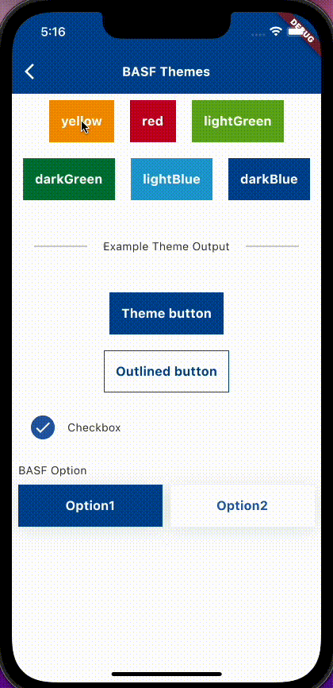

#### Colors
```dart
BasfColors.red,
/// etc...
```
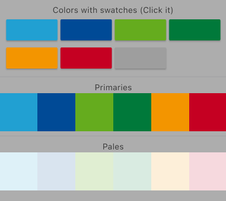

#### Fonts
```dart
Theme.of(context).textTheme.headline1!,
                         // headline2
                         // headline3
                         // headline4
                         // headline5
                         // headline6
                         // bodyText1
                         // bodyText2
                         // subtitle1
                         // subtitle2
                         // caption
                         // button
                         // overline
```
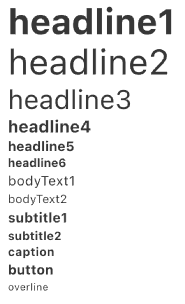

---

- ### Widgets
#### AppSnackBar
```dart
AppSnackBar.info(message: 'Button pressed').show(context);
// or
AppSnackBar.error(message: 'Button pressed').show(context);
```


#### BasfTextButton
```dart
BasfTextButton.contained(
        text: 'Styled Button',
        onPressed: () => _onPressed(context),
        style: TextButton.styleFrom(
          shape: RoundedRectangleBorder(borderRadius: BorderRadius.circular(0)),
          backgroundColor: BasfColors.red,
        ),
      ),
// or
BasfTextButton.transparent(
      context: context,
      text: 'Expanded Button',
      expanded: true,
      onPressed: () => _onPressed(context),
),
// or
BasfTextButton.hint(
      context: context,
      text: 'Hint Button',
      onPressed: () => _onPressed(context),
),
```

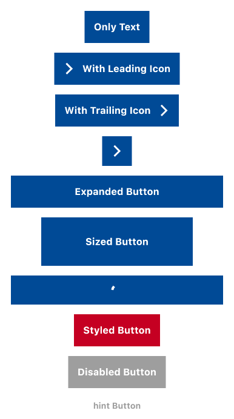

#### OutlinedButton
```dart
BasfOutlinedButton(
              text: 'Outlined Buttons',
              onPressed: () { /* --- */ },
            );
```

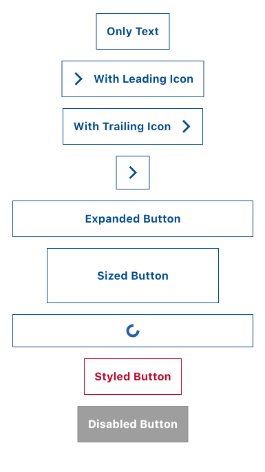

#### TransparentButton
```dart
BasfTextButton.transparent(
    context: context,
    text: 'Only Text',
    onPressed: () => _onPressed(context),
),
```

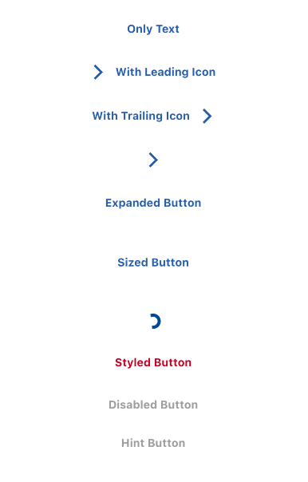

#### SliderButton
```dart
SliderButton(
    text: 'Basf Slider button',
    onConfirmation: () {},
),
```


#### Dialogs
```dart
BasfTextButton.contained(
    text: 'Text',
    onPressed: () {
    showDialog<void>(
            context: context,
            builder: (context) {
    	    return const BasfAlertDialog(
        	title: 'Title',
            	description: 'Body Text',
            	confirmText: 'Confirm Text',
            	dismissText: 'Dismiss Text',
                //onlyConfirm: true, // Optional to hide red text
            );
        },
    );
    },
);
```
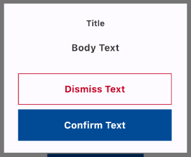

#### Text fields
```dart
BasfTextField(
    decoration: const InputDecoration(
        hintText: 'Enabled',
    ),
    controller: _enabledController,
),
```
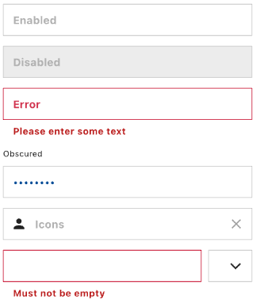


#### Dropdown
```dart
BasfDropDownInput(
    controller: TextEditingController(),
    values: const ['Option1', 'Option2', 'Option3'],
),
```
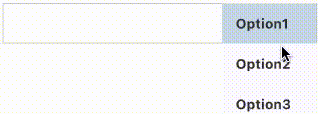

#### Radio
```dart
RadioOptions(
    title: 'BASF Radio',
    selectedValue: selectedValue,
    labelGenerator: (o) => '$o',
    values: values,
    onSelected: (value) {
      setState(() => selectedValue = value.toString());
    },
),
```
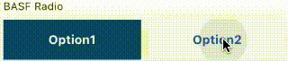

#### CheckBox
```dart
BasfCheckbox(
	value: selected, // Update this
	onChanged: change,
    // reverse: true, Optional
),
```
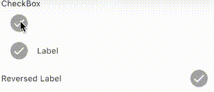

#### Icons
```dart
Icon(BasfIcons.add),
// or
Icon(BasfIconsData(code /* e842 */)),
```
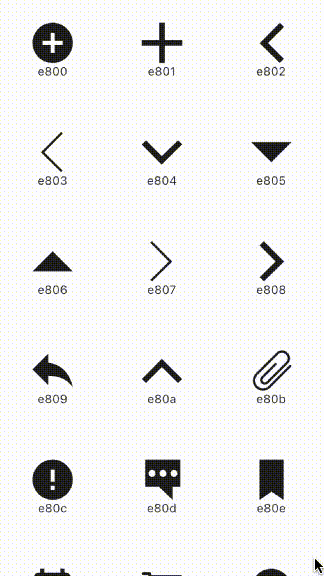

---

- ### Animations
#### Fade
```dart
Fade(
    visible: value, // Update this value
    child: Text('Sup'),
);
```
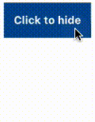

---

- ### Extensions
#### ThemeData on BuildContext

This extensions allows us to access a themedata based on the current context

```dart
final theme = context.theme; // Current ThemeData
```
#### Joined Widgets

This extension allows us to add a separator between each element of a List<Widget>
Usage: `joinWithSeparator`

```dart
[
 const Text('CARLOS'),
 const Text('MOBILE SOLUTIONS'),
].joinWithSeparator(); // You can also specify your own separator Widget
//.joinWithSeparator(const SizedBox(height: 10));
```

#### Spaced Widgets

This extension allows us to add a padding to a whole List<Widget>, by default excludes flex Widgets, such as `Expanded`, `Spacer` or `Flexible`
Usage: `spaced`

```dart
[
  const Text('CARLOS'),
  const Text('MOBILE SOLUTIONS'),
].spaced(); // You can also specify your own EdgeInsetsGeometry
//.spaced(padding: const EdgeInsets.all(10));
```

#### Log on Object

This extensions emits a log event of the current object, and returns the length of the output log
Usage: `log`

```dart
final testString = 'My String';
testString.log();
// Outputs -> 'My String' as a log event
```

#### Detailed Where on Map<K, V>

This set of extensions allows us to find an entry based on key, value, or both
Usage: `where`, `whereKey` and `whereValue`

```dart
<String, int>{'John': 20, 'Mary': 21, 'Peter': 20}

..where((key, value) => key.length > 4 && value >= 20) // {Peter: 22}

..whereKey((key) => key.length < 5) // {John: 20, Mary: 21}

..whereValue((value) => value.isEven); // {John: 20, Peter: 22}
```

#### Capitalization on String

This extensions allows us to safely capitalize or title-case a String
Usage: `toCapitalized` and `toTitleCase`

```dart
'carlos g'.toCapitalized(); // Carlos g
'carlos g'.toTitleCase(); // Carlos G
```

You can find how to use all of this components at the example project

[pub_badge]: https://img.shields.io/pub/v/basf_flutter_components.svg?label=basf_flutter_components
[pub_link]: https://pub.dev/packages/basf_flutter_components

[very_good_analysis_badge]: https://img.shields.io/badge/style-very_good_analysis-B22C89.svg
[very_good_analysis_link]: https://pub.dev/packages/very_good_analysis

[license_badge]: https://img.shields.io/badge/license-BSD%203-green.svg
[license_link]: https://opensource.org/licenses/BSD-3-Clause

[coverage_badge]: https://raw.githubusercontent.com/BASF-Mobile-Solutions/basf_flutter_components/master/coverage_badge.svg

[ci_badge]: https://github.com/BASF-Mobile-Solutions/basf_flutter_components/workflows/publish/badge.svg
[ci_link]: https://github.com/BASF-Mobile-Solutions/basf_flutter_components/actions
