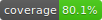
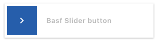

# basf_flutter_components

<p align="center">
  
</p>	

<p align="center">
  <a href="https://pub.dev/packages/basf_flutter_components">
     
  </a>
  <a href="mailto:Mobile-Solutions@basf.com">
     
  </a>
  <a href="https://pub.dev/packages/very_good_analysis">
     
  </a>
  <a href="https://opensource.org/licenses/BSD-3-Clause">
     
  </a>
  <a href="#">
     
  </a>
</p>

Generated by the [Very Good CLI](https://github.com/VeryGoodOpenSource/very_good_cli) 🤖

A BASF Flutter components library for Flutter

## Installing

Add BASF Flutter Components to your pubspec.yaml file:

```yaml
dependencies:
  basf_flutter_components:
```

Import the library into your `.dart` file:

```dart
import 'package:basf_flutter_components/basf_flutter_components.dart';
```

Use your IDE IntelliSense to import any of the [Components](#components) built into the library
- [Theme](#theme)
- [Widgets](#widgets)
- [Animations](#animations)

---

## BASF Flutter Components

- ### Theme

#### Themes
```dart
theme: BasfThemes.lightMainTheme(BasfThemeType.darkBlue),
/// etc...
```


#### Colors
```dart
BasfColors.red,
/// etc...
```


#### Fonts
```dart
Theme.of(context).textTheme.headline1!,
                         // headline2
                         // headline3
                         // headline4
                         // headline5
                         // headline6
                         // bodyText1
                         // bodyText2
                         // subtitle1
                         // subtitle2
                         // caption
                         // button
                         // overline
```


---

- ### Widgets
#### AppSnackBar
```dart
AppSnackBar.info(message: 'Button pressed').show(context);
// or
AppSnackBar.error(message: 'Button pressed').show(context);
```


#### BasfTextButton
```dart
BasfTextButton.contained(
        text: 'Styled Button',
        onPressed: () => _onPressed(context),
        style: TextButton.styleFrom(
          shape: RoundedRectangleBorder(borderRadius: BorderRadius.circular(0)),
          backgroundColor: BasfColors.red,
        ),
      ),
// or
BasfTextButton.transparent(
      context: context,
      text: 'Expanded Button',
      expanded: true,
      onPressed: () => _onPressed(context),
),
// or
BasfTextButton.hint(
      context: context,
      text: 'Hint Button',
      onPressed: () => _onPressed(context),
),
```


#### OutlinedButton
```dart
BasfOutlinedButton(
              text: 'Outlined Buttons',
              onPressed: () { /* --- */ },
            );
```


#### TransparentButton
```dart
BasfTextButton.transparent(
    context: context,
    text: 'Only Text',
    onPressed: () => _onPressed(context),
),
```


#### SliderButton
```dart
SliderButton(
    text: 'Basf Slider button',
    onConfirmation: () {},
),
```


#### Dialogs
```dart
BasfTextButton.contained(
    text: 'Text',
    onPressed: () {
    showDialog<void>(
            context: context,
            builder: (context) {
    	    return const BasfAlertDialog(
        	title: 'Title',
            	description: 'Body Text',
            	confirmText: 'Confirm Text',
            	dismissText: 'Dismiss Text',
                //onlyConfirm: true, // Optional to hide red text
            );
        },
    );
    },
);
```


#### Text fields
```dart
BasfTextField(
    decoration: const InputDecoration(
        hintText: 'Enabled',
    ),
    controller: _enabledController,
),
```


#### Dropdown
```dart
BasfDropDownInput(
    controller: TextEditingController(),
    values: const ['Option1', 'Option2', 'Option3'],
),
```


#### Radio
```dart
RadioOptions(
    title: 'BASF Radio',
    selectedValue: selectedValue,
    labelGenerator: (o) => '$o',
    values: values,
    onSelected: (value) {
      setState(() => selectedValue = value.toString());
    },
),
```


#### CheckBox
```dart
BasfCheckbox(
	value: selected, // Update this
	onChanged: change,
    // reverse: true, Optional
),
```


#### Icons
```dart
Icon(BasfIcons.add),
// or
Icon(BasfIconsData(code /* e842 */)),
```


---

- ### Animations
	- #### Fade
```dart
Fade(
    visible: value, // Update this value
    child: Text('Sup'),
);
```


You can find how to use all of this components at the example project
